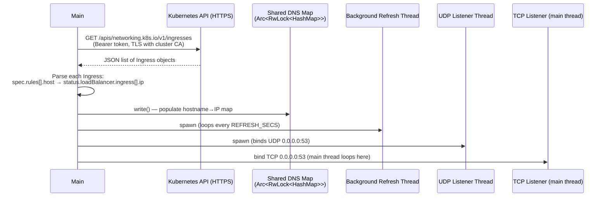
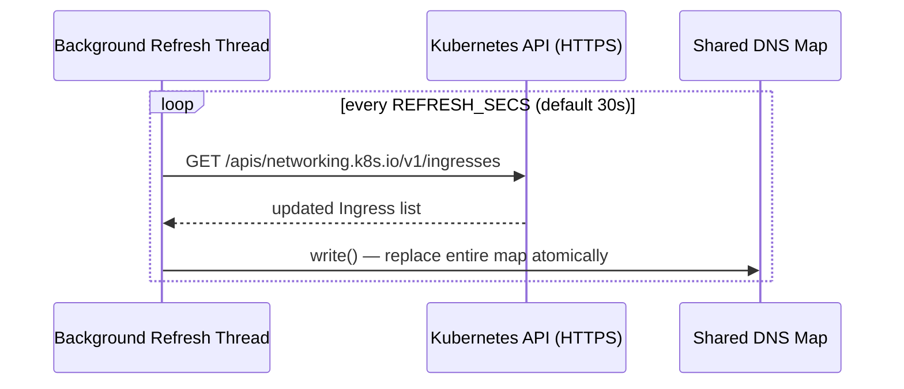
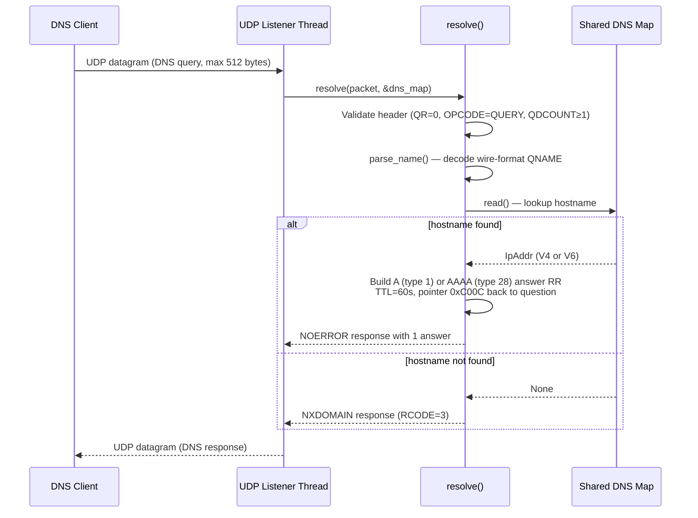
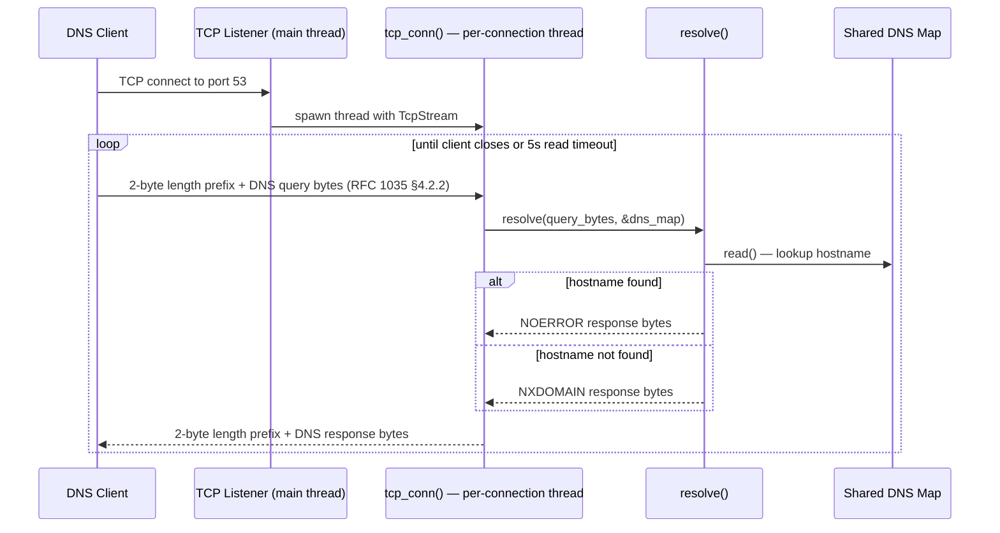
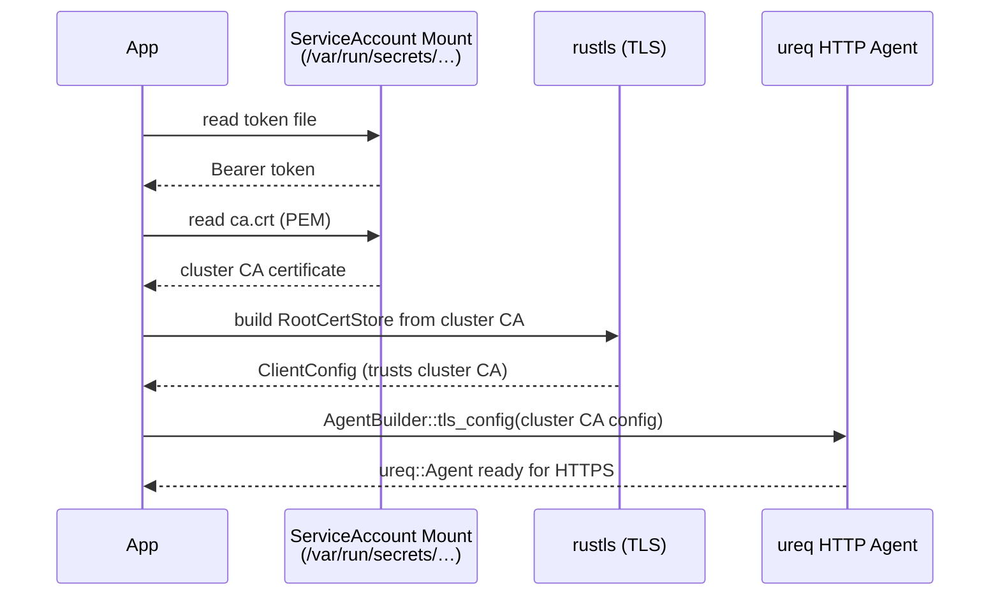

# homelab-dns — Architecture & Sequence Flows

A DNS server written in Rust that resolves Kubernetes Ingress hostnames to their LoadBalancer external IPs, with no system-level dependencies (pure-Rust TLS via `rustls`).

---

## Startup Sequence



---

## Background Refresh Sequence



---

## DNS Query over UDP



---

## DNS Query over TCP



---

## Kubernetes Client Initialisation (In-Cluster Only)



---

## Environment Variables

| Variable | Default | Description |
|---|---|---|
| `BIND_ADDR` | `0.0.0.0` | IP address to bind the DNS server |
| `DNS_PORT` | `53` | Port for both UDP and TCP listeners |
| `REFRESH_SECS` | `30` | How often to re-fetch Ingresses from K8s |
| `K8S_NAMESPACE` | *(all)* | Limit Ingress watch to a single namespace |
| `KUBERNETES_SERVICE_HOST` | `kubernetes.default.svc` | Injected by kubelet (auto-detected) |
| `KUBERNETES_SERVICE_PORT` | `443` | Injected by kubelet (auto-detected) |

## RBAC Requirements

```yaml
rules:
  - apiGroups: ["networking.k8s.io"]
    resources: ["ingresses"]
    verbs: ["get", "list"]
```
